# Linux Security Monitoring with auditd & Elastic

## Introduction


In this project, I configure the Linux Audit Framework (`auditd`) to monitor sensitive system activity, collect audit events with Elastic Agent, and forward them to the Elastic Stack for centralized analysis.

The goal is not only to generate Linux audit events, but also to understand how they are represented inside Elastic, identify valuable fields for detection engineering, and build a foundation for custom security detections based on auditd telemetry.


---


## Lab Architecture

| Layer | Component | 
|-------|-----------|
| **Endpoint** | Ubuntu Server 24.04 LTS |
| **Auditing** | auditd |
| **Log Collection** | Elastic Agent |
| **Data Storage** | Elasticsearch |
| **Visualization & Investigation** | Kibana |


---

## Installing auditd

The Linux Audit Framework was installed using the default Ubuntu package repository.


After installation, the audit service was enabled and verified.

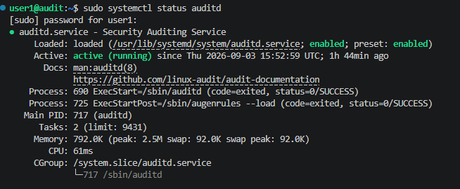


## Default auditd Behavior

One of the first observations during this lab was that a freshly installed auditd instance already records security events.

Listing configured audit rules shows an almost empty configuration:

```bash
sudo auditctl -l
```

However, querying the audit logs immediately returns events:

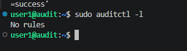


This behavior often surprises new users.

The reason is that auditd records several types of events generated internally by the Linux auditing subsystem, such as service startup, configuration changes, daemon lifecycle events, and other kernel-generated audit records. These events exist independently of any custom file or syscall monitoring rules.

Custom rules are only required when monitoring specific files, directories, system calls, users, or security-sensitive operations.

---

# Rule 1 - Monitoring /etc/passwd


## Why monitor this?

The `/etc/passwd` file stores essential information about local user accounts. Although password hashes are now reside in `/etc/shadow`, unauthorized modifications to `/etc/passwd` can still be used to create backdoor accounts, manipulate user IDs, or interfere with authentication.

Monitoring this file helps detect unauthorized changes that may indicate privilege escalation, persistence, or malicious system modification attempts.


## Audit Rule

```bash
-w /etc/passwd -p wa -k passwd_changes
```


## Rule Breakdown

| Component | Meaning | Example |
|-----------|---------|---------|
| `-w` | Watch a specific file | `/etc/passwd` |
| `/etc/passwd` | File being monitored | Local user database |
| `-p wa` | Monitor write (`w`) and attribute (`a`) changes | File modification, permission or ownership changes |
| `-k passwd_changes` | Assign a searchable key to generated events | `ausearch -k passwd_changes` |


## Why these permissions?

| Permission | Description | Why it matters |
|------------|-------------|----------------|
| **w** | Write operations | Detects modifications to the monitored file |
| **a** | Attribute changes | Detects permission, ownership or metadata changes |


## Creating the Rule

The custom audit rule was created inside the auditd rules directory.

```bash
sudo nano /etc/audit/rules.d/50-monitoring.rules
```


Reload the rules:

```bash
sudo augenrules --load
```

Verify that the rule has been successfully loaded:

```bash
sudo auditctl -l
```


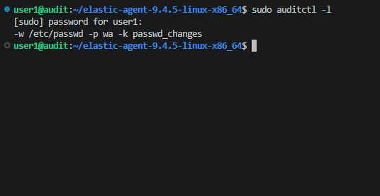

---

## Triggering the Rule

To generate an audit event, the monitored file was opened using elevated privileges.

```bash
sudo nano /etc/passwd
```

Saving the file generated multiple audit events associated with the custom rule.


## Local Verification

The generated events were verified locally using:

```bash
sudo ausearch -k passwd_changes
```

The output confirmed that the custom audit rule generated several related audit records

These records together describe the complete audited operation.

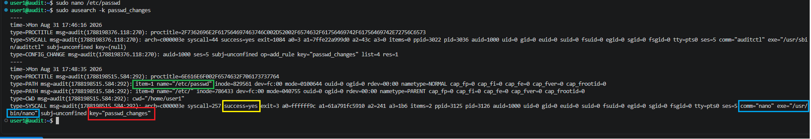


| Highlight                               | Description                                                                                                                                                  |
| --------------------------------------- | ------------------------------------------------------------------------------------------------------------------------------------------------------------ |
| 🟥**`key="passwd_changes"`**            | Custom audit key assigned to the audit rule. It allows related events to be quickly identified using `ausearch -k passwd_changes` or filtered inside Kibana. |
| 🟩**`item=1 name="/etc/passwd"`**       | File being monitored by the audit rule.                                                                                                                      |
| 🟨**`success=yes`**                     | Shows that the monitored operation completed successfully. Failed operations would appear as `success=no`.                                                   |
| 🟦**`comm="nano" exe="/usr/bin/nano"`** | Identifies the process that performed the operation. `comm` contains the command name, while `exe` provides the full executable path.                        |

---

## Forwarding Events to Elastic

The Ubuntu endpoint was enrolled into Elastic Fleet using Elastic Agent.

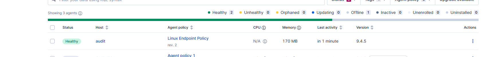

The **Auditd Logs** integration continuously monitors:

```text
/var/log/audit/audit.log
```

and forwards all audit events to Elasticsearch.

After triggering the rule, the event was successfully ingested into the `auditd.log` data stream.


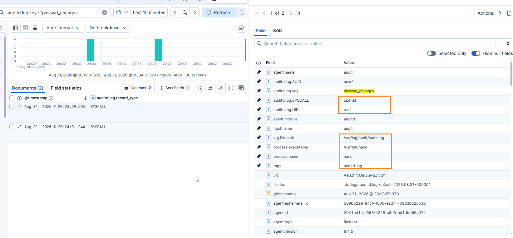

---

## Event Analysis

The generated event provides detailed forensic information describing the monitored activity.

| Field | Value | Description |
|--------|-------|-------------|
| `auditd.log.key` | `passwd_changes` | Identifies which audit rule generated the event |
| `process.name` | `nano` | Process responsible for accessing the monitored file |
| `process.executable` | `/usr/bin/nano` | Full executable path |
| `auditd.log.SYSCALL` | `openat` | Linux kernel system call |
| `auditd.log.success` | `true` | Operation completed successfully |
| `auditd.log.AUID` | `user1` | Original authenticated user |
| `auditd.log.UID` | `root` | Effective user executing the operation through `sudo` |


## Understanding AUID vs UID

One of auditd's most valuable features is the distinction between the authenticated user and the effective privileges used during an operation.

```text
user1
   │
   ▼
sudo nano /etc/passwd
   │
   ▼
AUID = user1
UID  = root
```

### AUID (Audit User ID)

Identifies the user who originally logged into the system.

### UID (User ID)

Represents the effective identity executing the operation.

In this example:

- `user1` authenticated to the system.
- `sudo` elevated privileges.
- `nano` accessed `/etc/passwd`.
- The operation executed as **root**, but auditd still preserves the identity of the original user.

This makes auditd extremely valuable during forensic investigations because privileged actions remain attributable to the user who initiated them.

---


# Rule 2 – Monitoring Changes to /etc/shadow

## Why monitor `/etc/shadow`?

The `/etc/shadow` file stores password hashes and password aging information for local Linux accounts. It is one of the most sensitive files on a Linux system.

Monitoring access to `/etc/shadow` enables SOC analysts to quickly identify unauthorized modifications to local account credentials.


The following rule monitors write (`w`) and attribute (`a`) changes to `/etc/shadow`.

```bash
-w /etc/shadow -p wa -k shadow_changes
```

## Rule Breakdown

| Component           | Meaning                                         | Example                                            |
| ------------------- | ----------------------------------------------- | -------------------------------------------------- |
| `-w`                | Watch a specific file                           | `/etc/shadow`                                      |
| `/etc/passwd`       | File being monitored                            | Local user database                                |
| `-p wa`             | Monitor write (`w`) and attribute (`a`) changes | File modification, permission or ownership changes |
| `-k passwd_changes` | Assign a searchable key to generated events     | `ausearch -k passwd_changes`                       |


## Triggering the Rule

To generate an audit event, the monitored file was opened with Nano.

```bash
sudo nano /etc/shadow
```

A blank line was inserted and saved to generate a legitimate filesystem write event.


## Local Verification

The generated events can be verified directly from the audit subsystem.

```bash
sudo ausearch -k shadow_changes
```

Expected output:

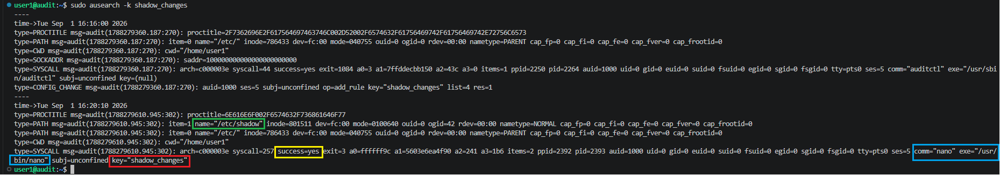


## Event Breakdown

| Highlight                   | Description                                                                |
| --------------------------- | -------------------------------------------------------------------------- |
| 🟥 **`key="shadow_changes"`** | Custom audit rule identifier used to locate events generated by this rule. |
| 🟩 **`name="/etc/shadow"`**   | File being monitored by the audit rule.                                    |
| 🟨 **`success=yes`**          | Indicates the monitored operation completed successfully.                  |
| 🟦 **`comm="nano"`**          | Process responsible for generating the event.                              |

---

## Event Forwarding to Elastic

Elastic Agent continuously monitors `/var/log/audit/audit.log` and forwards events to Elasticsearch.

After ingestion, the event becomes searchable inside Kibana Discover.

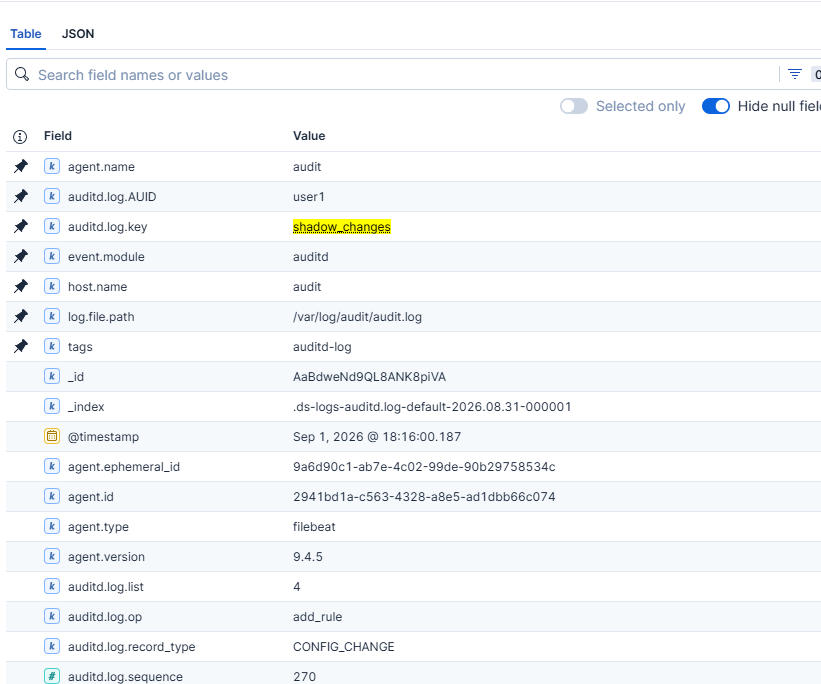

---

## Event Metadata

 Due to the way the auditd integration parses events into ECS fields, the Kibana **Table** view does not expose every attribute available in the original event. Some audit-specific fields are only visible in the raw JSON document, therefore the metadata below is referenced directly from the JSON representation.

```json
{
  "auditd": {
    "log": {
      "record_type": "SYSCALL",
      "key": "shadow_changes",
      "SYSCALL": "openat",
      "success": true,
      "AUID": "user1",
      "tty": "pts0"
    }
  }
}
```

### Important Fields

| Field | Description |
|--------|-------------|
| `record_type` | Audit event type (`SYSCALL`). |
| `key` | Custom rule identifier configured in auditd. |
| `SYSCALL` | Linux system call executed (`openat`). |
| `success` | Whether the monitored operation succeeded. |
| `AUID` | Original authenticated user who initiated the action (`user1`). |
| `tty` | Interactive terminal used to perform the action (`pts0`). |


## Event  Analysis

The event provides valuable forensic context.

| Field | Value | Security Value |
|-------|-------|----------------|
| Process | `nano` | Shows which application modified the file. |
| Executable | `/usr/bin/nano` | Full executable path. |
| User | `user1` | User responsible for the action. |
| Effective User | `root` | Operation executed with elevated privileges. |
| File | `/etc/shadow` | High-value authentication database. |
| Result | `success=yes` | Modification completed successfully. |

---


# Rule 3 – Monitoring Changes to /etc/sudoers


## Why Monitor This?

The `/etc/sudoers` file controls which users and groups are permitted to execute commands with elevated privileges using `sudo`. Because it directly governs administrative access, unauthorized modifications can be used to establish privilege escalation, persistence, or evade security controls.


## Audit Rule

```bash
-w /etc/sudoers -p wa -k sudoers_changes
```


## Triggering the rule

The following steps were performed to validate the detection.

```bash
sudo visudo
```

Again a blank line was inserted and saved to generate a legitimate filesystem write event.


## Event Validation

The generated audit event was verified using:

```bash
sudo ausearch -k sudoers_changes
```

## Event Breakdown

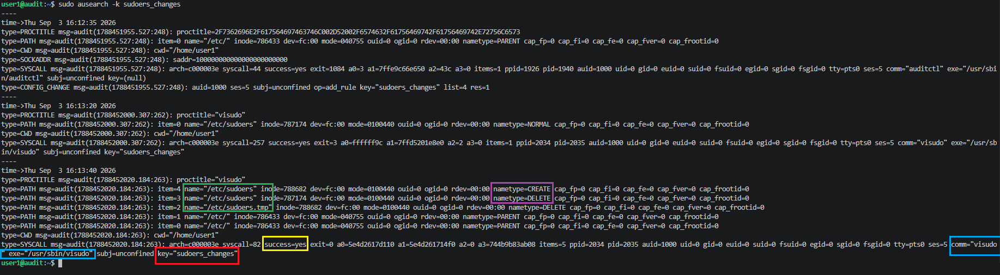


| Highlight                           | Description                                                                    |
| ----------------------------------- | ------------------------------------------------------------------------------ |
| 🟥**`key="sudoers_changes"`**       | Custom audit rule identifier used to locate events generated by this rule.     |
| 🟩 **`name="/etc/sudoers"`**          | Target file being modified                                                     |
| 🟨**`success=yes`**                   | Operation completed successfully                                               |
| 🟦 **`comm="visudo"`**                | Process responsible for the modification (`visudo`)                            |
| 🟪 **`nametype=CREATE / DELETE`** | File replacement operations performed by `visudo` `nametype=CREATE` / `DELETE` |

---

## Elastic Event Metadata

The event was successfully forwarded to Elastic Stack where important metadata can be observed.

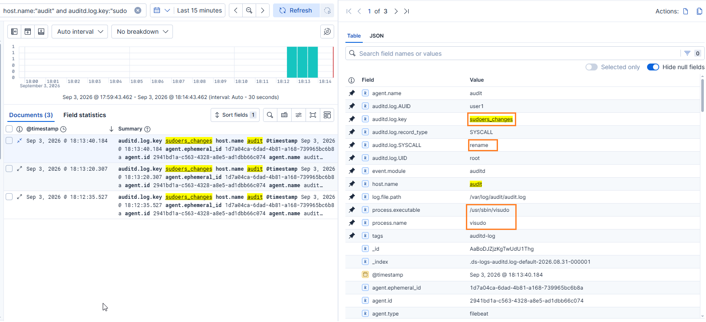
  
---

## Why does the event show `rename` instead of `write`?

`visudo` does not edit `/etc/sudoers` directly.

Instead, it:

1. Creates a temporary file.
2. Validates its syntax.
3. Atomically replaces the original file using the `rename()` system call.

This approach prevents corruption of the sudoers configuration and is considered the standard secure method for modifying the file.

---


# Rule 4 – Monitoring sudo Command Execution

## Why Monitor This?

The `sudo` command allows authorized users to execute commands with elevated privileges. Because it is commonly used for legitimate administration as well as privilege escalation, monitoring its execution provides valuable visibility into privileged activity on Linux systems.

Capturing `sudo` executions helps security analysts identify administrative actions, investigate suspicious behavior, and correlate privileged command execution with other security events.


## Audit Rule

```bash
-a always,exit -F arch=b64 -S execve -F exe=/usr/bin/sudo -F key=sudo_execution
```

## Rule Breakdown

| Rule Component | Description |
|---------------|-------------|
| `-a always,exit` | Generate an audit event whenever the specified system call completes, regardless of whether it succeeds or fails. |
| `-F arch=b64` | Apply the rule only to 64-bit system calls. |
| `-S execve` | Monitor the `execve()` system call responsible for launching new processes. |
| `-F exe=/usr/bin/sudo` | Restrict the rule to executions of the `sudo` binary only. |
| `-F key=sudo_execution` | Assign a custom identifier that simplifies searching and filtering related events. |


## Triggering the Rule

The following command was executed to validate the detection.

```bash
sudo ausearch -k sudo_execution
```

Executing any command through `sudo` generates an `EXECVE` event, which is collected by auditd and forwarded to Elastic Stack by Elastic Agent.

---


## Event Breakdown

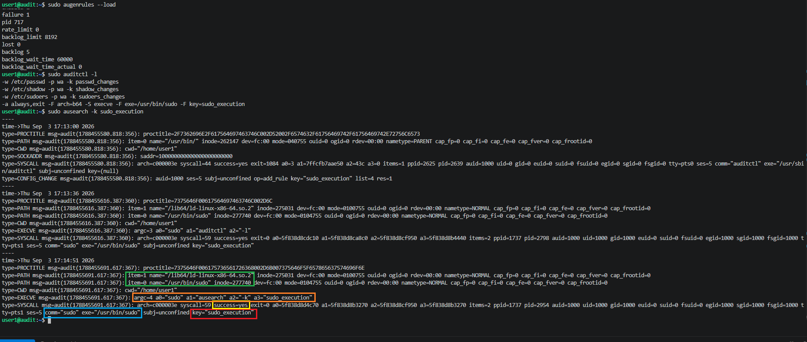


| Highlight | Description |
|-----------|-------------|
| 🟥 **`key="sudo_execution"`** | Custom audit rule identifier used to locate events generated by this rule. |
| 🟩 **`name="/usr/bin/sudo"`** | Executable monitored by the audit rule. |
| 🟨 **`success=yes`** | Command execution completed successfully. |
| 🟦 **`comm="sudo"`** | Process responsible for the execution. |
| 🟧 **`a0="sudo"` `a1="ausearch"` `a2="-k"` `a3="sudo_execution"`** | Captured command-line arguments from the `EXECVE` record showing the executed command. |

---

## Elastic Event Metadata

The event was successfully forwarded to Elastic Stack where important metadata can be observed.

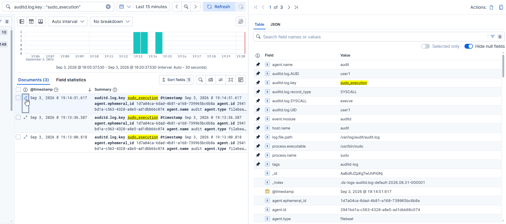

| Field | Value | Description |
|------|------|-------------|
| `process.name` | `sudo` | Executed process. |
| `process.executable` | `/usr/bin/sudo` | Full path of the executed binary. |
| `auditd.log.key` | `sudo_execution` | Audit rule identifier. |
| `auditd.log.SYSCALL` | `execve` | System call responsible for process execution. |
| `auditd.log.AUID` | `user1` | User who initiated the command. |
| `auditd.log.success` | `true` | Indicates that the execution completed successfully. |

---

## Why does the event show `execve`?

Unlike the previous rules that monitor changes to specific files, this rule observes **process execution**.

When a user runs `sudo`, the Linux kernel invokes the `execve()` system call to start the executable. Auditd records this system call together with the executed binary, command-line arguments, and user context.

This approach enables security analysts to detect privileged command execution rather than modifications to a particular file, providing visibility into administrative activity across the system.

---

## Event Analysis

The event provides valuable context about a privileged command execution, including who initiated it, which binary was executed, and whether the operation completed successfully.

| Field              | Value             | Security Value                                                |
|-------------------|-------------------|---------------------------------------------------------------|
| Process           | `sudo`            | Shows that a privileged command was executed.                 |
| Executable        | `/usr/bin/sudo`   | Full path of the monitored binary.                            |
| System Call       | `execve`          | Indicates execution of a new process.                         |
| User (AUID)       | `user1`           | Original authenticated user who initiated the command.        |
| Effective User    | `root`            | Command executed with elevated privileges.                    |
| Audit Key         | `sudo_execution`  | Custom identifier used to locate related audit events.        |
| Result            | `success=yes`     | The execution completed successfully.                         |

---

## Summary

In this first part of the project, I configured Linux `auditd`, integrated it with the Elastic Stack, 
and implemented several practical detection rules for monitoring changes to critical system files.

The next part of the project will focus on extending the monitoring capabilities with additional audit rules.

