# Part 2 — Advanced Linux Audit Rules

Part 2 extends the monitoring capabilities introduced in Part 1 by focusing on higher-value system activities commonly associated with persistence, privilege abuse, and post-exploitation techniques.

Each rule is designed to generate high-fidelity audit events that can be ingested into Elastic Stack, analyzed in Discover, and investigated using the metadata provided by Linux Audit Framework.

Every section includes:
- the audit rule implementation,
- trigger examples,
- raw Auditd evidence,
- Elastic event metadata,
- event breakdown,
- detection analysis,
- syscall explanation where applicable,
- and implementation notes or limitations.

Together, these rules provide practical detection use cases aligned with real-world Linux security monitoring and SOC workflows.

## Lab Architecture

| Layer | Component | 
|-------|-----------|
| **Endpoint** | Ubuntu Server 24.04 LTS |
| **Auditing** | auditd |
| **Log Collection** | Elastic Agent |
| **Data Storage** | Elasticsearch |
| **Visualization & Investigation** | Kibana |

---

# Rule 5 – Monitoring Changes to `/etc/ssh/sshd_config`

## Why Monitor This?

The `/etc/ssh/sshd_config` file defines the configuration of the OpenSSH server, including authentication methods, root login permissions, and network access settings.

Unauthorized modifications to this file may weaken system security, enable unauthorized remote access, or establish persistence by changing SSH authentication behavior.

Monitoring changes to the SSH server configuration provides early visibility into potentially malicious administrative activity.


## Audit Rule

The following rule monitors write (`w`) and attribute (`a`) changes to the SSH server configuration.

```
-w /etc/ssh/sshd_config -p wa -k ssh_config_changes
```


## Triggering the Rule

To generate an audit event, the SSH server configuration file was opened with Nano.

```
sudo nano /etc/ssh/sshd_config
```

A blank line was inserted and saved to generate a legitimate filesystem write event.


## Local Verification

The generated audit events were verified directly from the Linux audit subsystem.

```
sudo ausearch -k ssh_config_changes
```

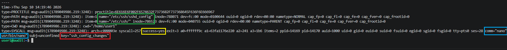


## Event Breakdown

|Highlight|Description|
|---|---|
|🟥 **`key="ssh_config_changes"`**|Custom audit rule identifier used to locate events generated by this rule.|
|🟩 **`name="/etc/ssh/sshd_config"`**|SSH server configuration file monitored by the audit rule.|
|🟨 **`success=yes`**|Indicates that the monitored operation completed successfully.|
|🟦 **`comm="nano"`**|Process responsible for modifying the configuration file.|

---

## Event Metadata

Due to the way the auditd integration maps Linux audit events into ECS fields, the Kibana **Table** view does not expose every audit-specific attribute. The metadata below is therefore referenced directly from the raw JSON representation of the event.

```
{
  "auditd": {
    "log": {
      "record_type": "SYSCALL",
      "key": "ssh_config_changes",
      "SYSCALL": "openat",
      "success": true,
      "AUID": "user1",
      "tty": "pts0"
    }
  }
}
```

---

## Detection Analysis

The generated event provides valuable forensic context describing who modified the SSH configuration and how the operation was performed.

| Field          | Value                  | Security Value                                              |
| -------------- | ---------------------- | ----------------------------------------------------------- |
| Process        | `nano`                 | Application used to modify the SSH configuration.           |
| Executable     | `/usr/bin/nano`        | Full executable path.                                       |
| User           | `user1`                | Original authenticated user who initiated the modification. |
| Effective User | `root`                 | Operation executed with elevated privileges.                |
| File           | `/etc/ssh/sshd_config` | Primary OpenSSH server configuration file.                  |
| Result         | `success=yes`          | Modification completed successfully.                        |

---

# Rule 6 – Monitoring Cron Persistence

## Why Monitor This?

The Linux **Cron** service is commonly used to schedule recurring tasks. While it is an essential administrative tool, attackers frequently abuse cron jobs to establish persistence by executing malicious commands at predefined intervals.

Monitoring changes to cron configuration helps detect unauthorized scheduled tasks that may indicate persistence mechanisms or post-exploitation activity.

---

## Detection Overview

|Category|Value|
|---|---|
|**MITRE ATT&CK**|**T1053.003 – Scheduled Task/Job: Cron**|
|**Monitored Objects**|`/etc/crontab`, `/etc/cron.d/`, `/var/spool/cron/`|
|**Audit Key**|`cron_changes`|
|**Log Source**|Linux auditd|
|**Destination**|Elastic Stack|


## Audit Rule

The following rules monitor modifications to both system-wide and user-specific cron configurations.

```
-w /etc/crontab -p wa -k cron_changes
-w /etc/cron.d/ -p wa -k cron_changes
-w /var/spool/cron/ -p wa -k cron_changes
```

## Rule Breakdown

|Monitored Path|Purpose|Typical Use|
|---|---|---|
|`/etc/crontab`|Monitors changes to the system-wide cron configuration.|System-wide scheduled tasks executed by the operating system.|
|`/etc/cron.d/`|Monitors creation and modification of additional cron configuration files.|Applications and packages often install scheduled jobs in this directory.|
|`/var/spool/cron/`|Monitors user-specific crontab files created with `crontab -e`.|Per-user scheduled tasks that may be abused for persistence.|


## Triggering the Rule

Two scenarios were used to validate the detection.

### Scenario 1 – System Cron

```
sudo nano /etc/crontab
```

A blank line was inserted and saved to generate a filesystem write event.

### Scenario 2 – User Cron

```
crontab -e
```

A new user cron entry was created and saved.


## Local Verification

The generated audit events were verified locally using:

```
sudo ausearch -k cron_changes
```

The output confirms that auditd successfully detected modifications to both the system cron configuration and the user crontab.


## Event Breakdown

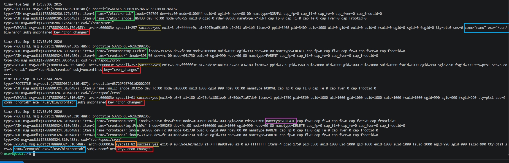

|Highlight|Description|
|---|---|
|🟥 **`key="cron_changes"`**|Custom audit rule identifier used to locate events generated by this rule.|
|🟩 **`name="/etc/crontab"`** / **`name="crontabs/user1"`**|Indicates whether the modification affected the system cron configuration or a user's personal crontab.|
|🟨 **`success=yes`**|Operation completed successfully.|
|🟦 **`comm="nano"`** / **`comm="crontab"`**|Process responsible for modifying the cron configuration.|
|🟪 **`nametype=CREATE` / `DELETE`**|Temporary cron file replaced with the final user crontab during a safe save operation.|
|🟧 **`syscall=82`**|Linux kernel system call corresponding to `rename()`, used when saving the updated user crontab.|

---

## Event Metadata

The metadata below is referenced directly from the JSON representation of the audit event forwarded to Elastic Stack.

```
{
  "auditd": {
    "log": {
      "record_type": "SYSCALL",
      "key": "cron_changes",
      "SYSCALL": "rename",
      "success": true,
      "AUID": "user1",
      "UID": "user1"
    }
  }
}
```

---

## Why does the event show `syscall=82`?

When a user saves a cron job using `crontab -e`, the utility does not modify the existing crontab directly.

Instead, it:

1. Creates a temporary file.
2. Writes the updated cron schedule.
3. Atomically replaces the existing crontab using the Linux `rename()` system call.

In the local `ausearch` output, this operation appears as **`syscall=82`**, which is the numeric identifier for `rename()` on x86_64 Linux systems.

After the event is forwarded to Elastic Stack, the auditd integration resolves the numeric value and displays the symbolic system call name (`rename`), making the event easier to interpret during investigations.

---

## Detection Analysis

The generated event provides valuable context about modifications to scheduled tasks.

|Field|Value|Security Value|
|---|---|---|
|Process|`crontab`|Utility used to manage scheduled tasks.|
|Executable|`/usr/bin/crontab`|Full path of the executed binary.|
|System Call|`rename`|Indicates that the updated crontab safely replaced the previous version.|
|User (AUID)|`user1`|User who created or modified the scheduled task.|
|Effective User|`user1`|Operation executed without privilege escalation.|
|Audit Key|`cron_changes`|Identifies events generated by the custom audit rule.|
|Result|`success=yes`|Modification completed successfully.|

---

## SOC Investigation

When investigating this alert, an analyst should verify:

- Was the cron job expected or recently authorized?
- Which user created or modified the scheduled task?
- Does the scheduled command execute a trusted binary?
- Are there unusual execution intervals or suspicious commands?
- Were other persistence mechanisms observed on the host?

Correlating cron modifications with process execution, authentication logs, and shell history provides additional context for identifying persistence established after system compromise.


# Rule 7 – Monitoring Local User Account Management

## Why Monitor This?

The `useradd`, `usermod`, and `userdel` utilities are responsible for creating, modifying, and removing local user accounts on Linux systems. Unauthorized account management activity may indicate privilege escalation, persistence, or unauthorized administrative actions.

Monitoring these executables enables analysts to detect changes to local accounts before investigating the resulting modifications to authentication-related files such as `/etc/passwd`, `/etc/shadow`, and `/etc/group`.


## Audit Rule

```
-a always,exit -F arch=b64 -S execve -F exe=/usr/sbin/useradd -k user_management
-a always,exit -F arch=b64 -S execve -F exe=/usr/sbin/usermod -k user_management
-a always,exit -F arch=b64 -S execve -F exe=/usr/sbin/userdel -k user_management
```

---

## Rule Breakdown

|Component|Meaning|
|---|---|
|`-a always,exit`|Generate an event whenever the monitored syscall completes.|
|`-F arch=b64`|Apply the rule to 64-bit system calls.|
|`-S execve`|Monitor process execution.|
|`-F exe=...`|Restrict monitoring to a specific account management utility.|
|`-k user_management`|Assign a searchable audit key.|

---

# Trigger 1 – Creating a Local User

## Triggering the Rule

```
sudo useradd test
```

Local verification:

```
sudo ausearch -k user_management
```

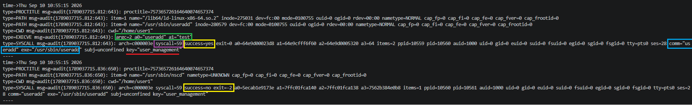

---

## Event Breakdown

|Highlight|Description|
|---|---|
|🟥 **`key="user_management"`**|Audit rule identifier.|
|🟩 **`argc=2 a0="useradd" a1="test"`**|Captured command-line arguments showing the executed command.|
|🟨 **`success=yes`**|User creation completed successfully.|
|🟦 **`comm="useradd"`**|Process responsible for the operation.|
|🟪 **`syscall=59`**|Linux `execve()` system call used to execute the binary.|

---

## Elastic Event Metadata

The event was successfully forwarded to Elastic Stack.

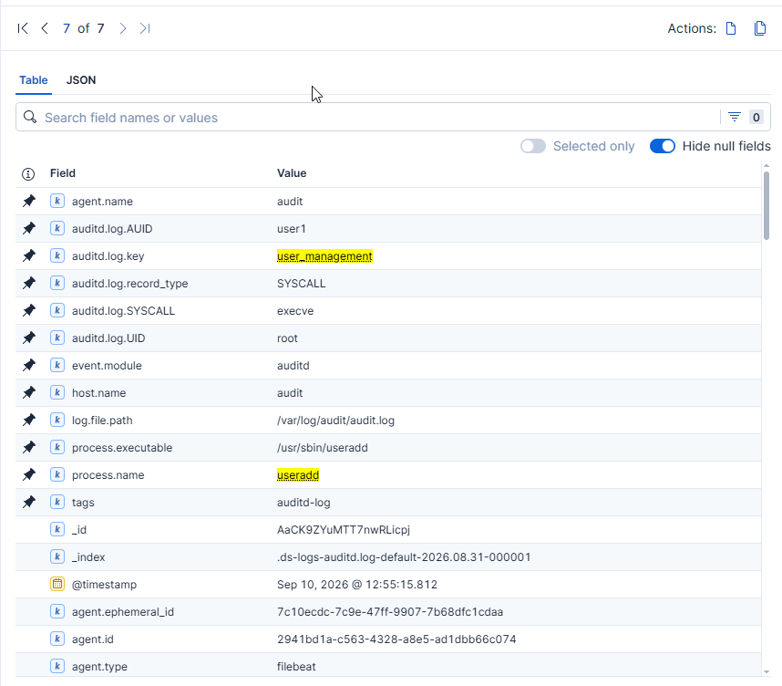

Due to the way the auditd integration maps events into ECS fields, the metadata below is referenced directly from the raw JSON document.

```
{
  "auditd": {
    "log": {
      "record_type": "SYSCALL",
      "key": "user_management",
      "SYSCALL": "execve",
      "AUID": "user1",
      "UID": "root",
      "success": true
    }
  }
}
```

---

## Why does the event show `syscall=59`?

The `useradd` utility is executed as a normal Linux process.

When it is launched, the Linux kernel invokes the `execve()` system call (`syscall=59` on x86_64) to start the executable. Auditd records this event together with the executed binary, command-line arguments, authenticated user, and execution result.

Monitoring `execve()` provides visibility into administrative actions before subsequent modifications are made to system account databases.

---

## Detection Analysis

|Field|Value|Security Value|
|---|---|---|
|Process|`useradd`|Administrative account creation utility.|
|Executable|`/usr/sbin/useradd`|Full executable path.|
|System Call|`execve`|Indicates execution of a privileged administrative process.|
|User (AUID)|`user1`|Original authenticated user.|
|Effective User|`root`|Command executed with elevated privileges.|
|Audit Key|`user_management`|Links related account management events.|
|Result|`success=yes`|Operation completed successfully.|

---

# Trigger 2 – Modifying a Local User

## Triggering the Rule

```
sudo usermod -aG sudo test
```


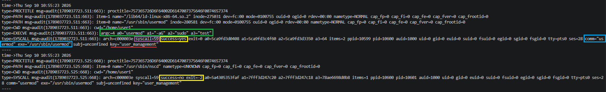

---

### Event Breakdown

| Highlight                                                  | Description                                                   |
| ---------------------------------------------------------- | ------------------------------------------------------------- |
| 🟥 **`key="user_management"`**                             | Audit rule identifier.                                        |
| 🟩 **`argc=4 a0="usermod" a1="-aG" a2="sudo" a3="test" `** | Captured command-line arguments showing the executed command. |
| 🟨 **`success=yes`**                                       | User creation completed successfully.                         |
| 🟦 **`comm="useradd"`**                                    | Process responsible for the operation.                        |
| 🟪 **`syscall=59`**                                        | Linux `execve()` system call used to execute the binary.      |


---

## Elastic Event Metadata

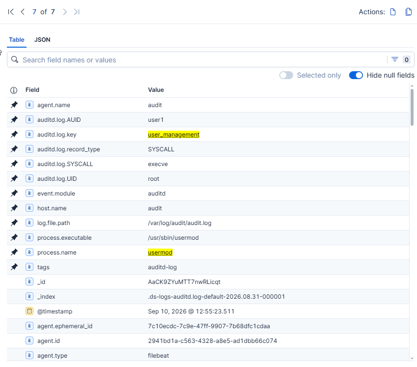

```
{
  "auditd": {
    "log": {
      "record_type": "SYSCALL",
      "key": "user_management",
      "SYSCALL": "execve",
      "AUID": "user1",
      "UID": "root",
      "success": true
    }
  }
}
```

---

## Detection Analysis

|Field|Value|Security Value|
|---|---|---|
|Process|`usermod`|Administrative account modification utility.|
|Executable|`/usr/sbin/usermod`|Full executable path.|
|System Call|`execve`|Administrative process execution.|
|User (AUID)|`user1`|User initiating the action.|
|Effective User|`root`|Elevated privileges used.|
|Result|`success=yes`|Account modified successfully.|

---

# Trigger 3 – Deleting a Local User

## Triggering the Rule

```
sudo userdel test
```

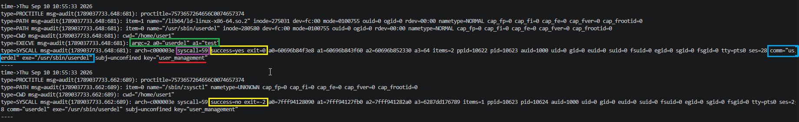

---

### Event Breakdown

| Highlight                              | Description                                                   |
| -------------------------------------- | ------------------------------------------------------------- |
| 🟥 **`key="user_management"`**         | Audit rule identifier.                                        |
| 🟩 **`argc=2 a0="userdel" a1="test"`** | Captured command-line arguments showing the executed command. |
| 🟨 **`success=yes`**                   | User creation completed successfully.                         |
| 🟦 **`comm="useradd"`**                | Process responsible for the operation.                        |
| 🟪 **`syscall=59`**                    | Linux `execve()` system call used to execute the binary.      |


## Elastic Event Metadata


```
{
  "auditd": {
    "log": {
      "record_type": "SYSCALL",
      "key": "user_management",
      "SYSCALL": "execve",
      "AUID": "user1",
      "UID": "root",
      "success": true
    }
  }
}
```


## Detection Analysis

| Field          | Value               | Security Value                          |
| -------------- | ------------------- | --------------------------------------- |
| Process        | `userdel`           | Administrative account removal utility. |
| Executable     | `/usr/sbin/userdel` | Full executable path.                   |
| System Call    | `execve`            | Administrative process execution.       |
| User (AUID)    | `user1`             | Original authenticated user.            |
| Effective User | `root`              | Elevated privileges used.               |
| Result         | `success=yes`       | Account removed successfully.           |

---

# Rule 8 – Monitor Systemd Service Installation

## Why monitor Systemd services?

Systemd services define applications and processes that are automatically started during system boot or on demand.

Attackers frequently establish persistence by installing new services or modifying existing ones to execute malicious code with elevated privileges.

Monitoring the systemd service directories allows defenders to detect the creation of new services, modifications to existing unit files, and other changes that may indicate persistence mechanisms or unauthorized administrative activity.


## Audit Rule

The following rules monitor the primary locations used to store systemd service definitions.

```
-w /etc/systemd/system -p wa -k systemd_service_changes
-w /usr/lib/systemd/system -p wa -k systemd_service_changes
-w /lib/systemd/system -p wa -k systemd_service_changes
```

---

## Rule Breakdown

|Component|Description|
|---|---|
|`/etc/systemd/system`|Local administrator-managed service definitions. New custom services are typically created here.|
|`/usr/lib/systemd/system`|Distribution-provided service unit files installed by packages.|
|`/lib/systemd/system`|Compatibility path used by many Linux distributions for packaged services.|
|`-p wa`|Monitor write (`w`) and attribute (`a`) changes.|
|`-k systemd_service_changes`|Assign a searchable audit key.|

---

# Trigger – Creating a New Service

A new systemd service was created manually.

```
sudo nano /etc/systemd/system/test.service
```

The service definition was saved to disk, generating an audit event.


### Event Breakdown

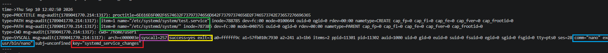

|Highlight|Description|
|---|---|
|🟥 **key="systemd_service_changes"**|Custom audit rule identifier.|
|🟩 **name="/etc/systemd/system/test.service"**|Newly created service definition.|
|🟨 **success=yes**|File creation completed successfully.|
|🟦 **comm="nano"**|Process responsible for creating the service file.|
|🟪 **syscall=257**|Linux `openat()` system call used during file creation.|

---

## Why does the event show `syscall=257`?

Auditd records the low-level Linux system call responsible for the operation rather than the higher-level user action.

Creating a new service file with Nano ultimately invokes the `openat()` system call (`257` on x86_64), which opens or creates the file before writing its contents.

Elastic automatically resolves this value to:

```
SYSCALL = openat
```

making the event easier to interpret during analysis.


## Event Metadata

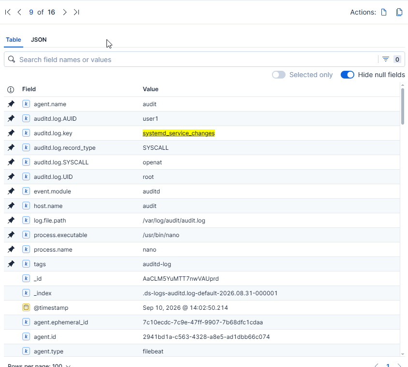

The following metadata is taken directly from the JSON representation of the audit event.

```
{
  "auditd": {
    "log": {
      "record_type": "SYSCALL",
      "key": "systemd_service_changes",
      "SYSCALL": "openat",
      "success": true,
      "AUID": "user1",
      "tty": "pts0"
    }
  }
}
```


## Detection Analysis

This event indicates that a **new systemd service definition** was created on the host.

Unlike previous examples that focused on file modifications, this activity may represent the installation of a new persistent execution mechanism.

The event provides valuable forensic context, including:

|Field|Security Value|
|---|---|
|Service file|`/etc/systemd/system/test.service`|
|Process|`nano`|
|Executable|`/usr/bin/nano`|
|User|`user1`|
|Effective User|`root`|
|Result|`success=yes`|

From a SOC perspective, analysts should determine whether the newly created service is legitimate or whether it represents an attempt to establish persistence on the system.

---

## Notes and Limitations

During the design of this lab, an additional objective was to monitor **service activation and persistence** through commands such as:

```
sudo systemctl enable test.service
sudo systemctl disable test.service
```

In practice, these operations did not consistently generate events matching the configured watch rules.

This behavior is expected because `systemctl` communicates with the running **systemd** process (PID 1) over **D-Bus**. The actual filesystem changes are performed internally by the `systemd` daemon rather than directly by the `systemctl` process. As a result, simple file watch rules (`-w`) do not always capture these operations in a way that can be reliably correlated with the initiating command.

For this reason, the current implementation focuses on monitoring the creation and modification of service definition files, which provides consistent and reproducible audit events while still detecting one of the most common persistence techniques on Linux systems.

---

# Rule 9 – Monitor Mount Operations

## Why monitor mount operations?

Mount operations attach filesystems to the Linux directory hierarchy, making their contents accessible to users and processes.

Although mounting filesystems is a routine administrative task, unexpected mount activity may indicate attempts to introduce external storage, access hidden data, stage malicious tools, or establish persistence through additional filesystems.

Monitoring mount operations provides visibility into low-level system activity that is often overlooked by traditional log sources.


## Audit Rule

The following rule monitors every invocation of the Linux `mount()` system call.

```
-a always,exit -F arch=b64 -S mount -k mount_operations
```


## Rule Breakdown

|Component|Description|
|---|---|
|`-a always,exit`|Generate an audit event whenever the monitored system call completes.|
|`-F arch=b64`|Monitor the 64-bit system call table.|
|`-S mount`|Audit the Linux `mount()` system call.|
|`-k mount_operations`|Assign a searchable key to generated events.|


## Triggering the Rule

A temporary filesystem was mounted using `tmpfs`.

```
sudo mkdir /mnt/test
sudo mount -t tmpfs tmpfs /mnt/test
```

This generated an audit event for the successful mount operation.


### Event Breakdown

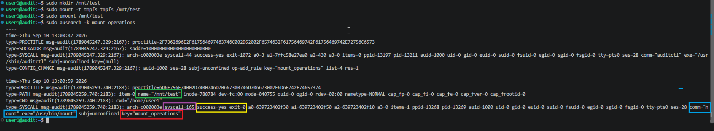

|Highlight|Description|
|---|---|
|🟥 **key="mount_operations"**|Custom audit rule identifier used to locate mount events.|
|🟩 **name="/mnt/test"**|Mount point where the filesystem was attached.|
|🟨 **success=yes**|Indicates the mount operation completed successfully.|
|🟦 **comm="mount"**|Process responsible for performing the mount operation.|
|🟪 **syscall=165**|Linux `mount()` system call executed by the kernel.|

---

## Why does the event show `syscall=165`?

Auditd records the underlying Linux system call rather than the high-level command executed by the user.

On x86_64 systems, the `mount()` system call is assigned number **165**. Whenever a filesystem is successfully mounted, Auditd records `syscall=165`, which Elastic automatically resolves to:

```
SYSCALL = mount
```

This provides a reliable method of detecting mount activity regardless of whether it was initiated through the `mount` utility or another application invoking the same system call.

---

## Event Metadata

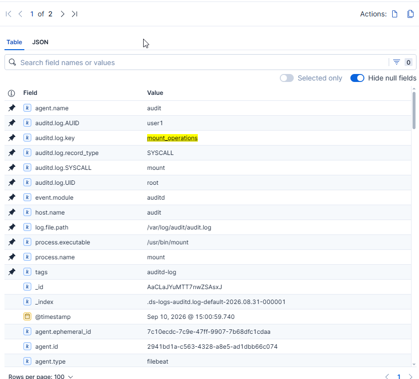

The following metadata is taken directly from the JSON representation of the audit event.

```
{
  "auditd": {
    "log": {
      "record_type": "SYSCALL",
      "key": "mount_operations",
      "SYSCALL": "mount",
      "success": true,
      "AUID": "user1",
      "tty": "pts0"
    }
  }
}
```

---

## Detection Analysis

This event indicates that a new filesystem was mounted on the host.

While mounting removable media or temporary filesystems can be part of normal system administration, unexpected mount activity may indicate attempts to access external storage, introduce malicious tools, conceal data, or establish persistence through additional filesystems.

The event provides valuable forensic context.

|Field|Security Value|
|---|---|
|Mount Point|`/mnt/test`|
|Process|`mount`|
|Executable|`/usr/bin/mount`|
|User|`user1`|
|Effective User|`root`|
|Result|`success=yes`|

Monitoring mount operations gives SOC analysts visibility into low-level system activity that frequently accompanies privilege escalation, persistence, or post-exploitation techniques.


## SOC Investigation

When investigating this alert, an analyst should verify:

- Was the mounted filesystem expected?
- Who initiated the mount operation?
- Was removable or external storage involved?
- Does the mounted filesystem contain suspicious binaries or scripts?
- Was the mount operation followed by execution of files from the newly mounted location?
- Were additional persistence or privilege escalation activities observed immediately afterwards?

---

# Rule 10 — Monitor Kernel Module Loading


# Why monitor kernel modules?

Unlike ordinary user-space applications, kernel modules become part of the running Linux kernel after being loaded.

This gives them unrestricted access to:

- physical memory
- hardware devices
- kernel memory
- process scheduling
- filesystem internals


Kernel modules execute inside the Linux kernel with the highest privilege level (**Ring 0**). Unauthorized module loading may indicate rootkits, malicious drivers, or kernel-level persistence mechanisms.

Monitoring these operations provides visibility into one of the most privileged execution contexts available on a Linux system.


# What is Ring 0?

Modern x86 processors implement a hardware privilege model based on **four protection rings** (0–3). Each ring defines the level of access a process has to CPU instructions, memory, and hardware resources.

|Ring|Privilege Level|Typical Usage|
|---|---|---|
|**Ring 0**|Highest|Linux kernel and kernel modules|
|**Ring 1**|High|Rarely used by modern operating systems|
|**Ring 2**|Medium|Rarely used by modern operating systems|
|**Ring 3**|Lowest|User-space applications (bash, nano, Firefox, systemctl, etc.)|

In practice, Linux uses only two privilege levels:

- **Ring 0** — the Linux kernel and kernel modules
- **Ring 3** — all user-space applications

Rings 1 and 2 exist in the processor architecture but are generally unused by modern Linux systems.

Because kernel modules execute in **Ring 0**, they have unrestricted access to:

- kernel memory
- physical memory
- hardware devices
- filesystem internals
- process management
- network stack

For this reason, unauthorized kernel module loading is considered a high-risk security event and is commonly associated with rootkits and advanced persistence techniques.

---

# Audit Rules

```
-a always,exit -F arch=b64 -S init_module -S finit_module -S delete_module -k kernel_module_activity

```


# Rule Breakdown

|Component|Description|
|---|---|
|`-a always,exit`|Generate an audit event whenever the monitored syscall completes.|
|`-F arch=b64`|Apply the rule to the 64-bit syscall table used on x86_64 systems.|
|`-S init_module`|Monitor the legacy syscall used to load kernel modules.|
|`-S finit_module`|Monitor the modern syscall used by `modprobe` to load kernel modules from file descriptors.|
|`-S delete_module`|Monitor kernel module unloading operations.|
|`-k kernel_module_activity`|Assign a searchable audit key for SIEM correlation.|


# Test Scenario

## Trigger 1 — Load a Kernel Module

```
sudo modprobe dummy
```

## Event Breakdown

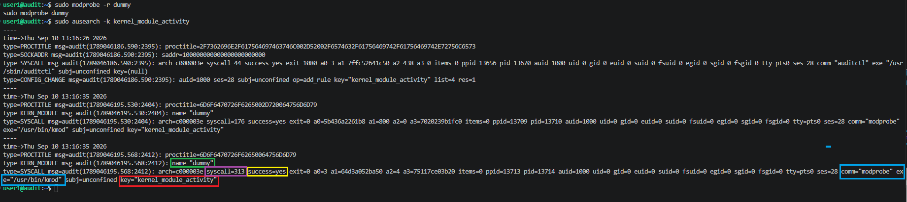

| Highlight                           | Description                                                                        |
| ----------------------------------- | ---------------------------------------------------------------------------------- |
| 🟥 **key="kernel_module_activity"** | Custom audit rule identifier used to locate mount events.                          |
| 🟩 **name="dummy"**                 | Name of the affected kernel module.                                                |
| 🟨 **success=yes**                  | Indicates the mount operation completed successfully.                              |
| 🟦 **comm="modprobe"**              | User-space utility that requested the kernel to load the module.                   |
| 🟪 **syscall=313**                  | Linux system call responsible for loading a kernel module into the running kernel. |


### Event Metadata


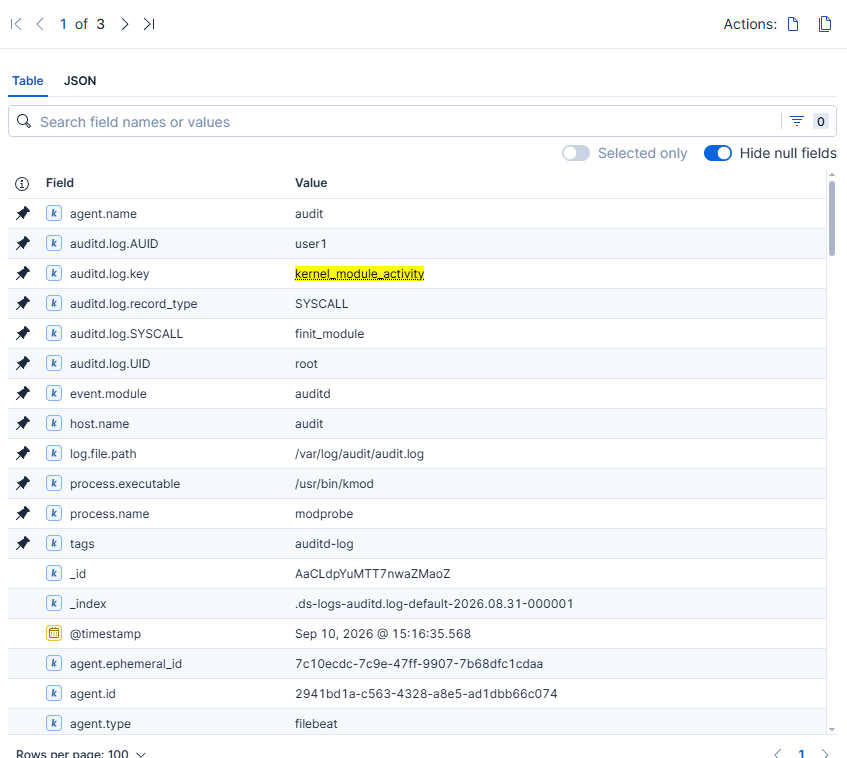

The metadata below is taken directly from the JSON representation of the audit event stored in Elasticsearch.

```
{
  "auditd": {
    "log": {
      "record_type": "SYSCALL",
      "key": "kernel_module_activity",
      "SYSCALL": "finit_module",
      "success": true,
      "AUID": "user1",
      "tty": "pts0"
    }
  }
}
```

### Detection Analysis

|Observation|Value|
|---|---|
|Operation|Kernel module loaded|
|Syscall|`finit_module`|
|Process|`modprobe`|
|Executable|`/usr/bin/kmod`|
|Initiating User|`user1` (AUID)|
|Effective User|`root`|
|Privilege Level|Ring 0|
|Result|Success|


## Why does the event show `syscall=313`?

Linux assigns a numeric identifier to every system call.

When `modprobe` loads a module, it ultimately invokes the kernel's `finit_module()` syscall.

On x86_64 Linux systems this syscall is assigned number **313**, which Auditd records.

Elastic automatically resolves the numeric value into the human-readable syscall name:

```
313 → finit_module
```

---

## Trigger 2 — Unload a Kernel Module

```
sudo modprobe -r dummy
```

## Event Breakdown

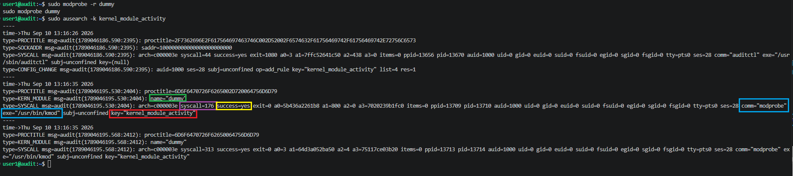

| Highlight                           | Description                                                                         |
| ----------------------------------- | ----------------------------------------------------------------------------------- |
| 🟥 **key="kernel_module_activity"** | Custom audit rule identifier used to locate mount events.                           |
| 🟩 **name="dummy"**                 | Name of the affected kernel module.                                                 |
| 🟨 **success=yes**                  | Indicates the mount operation completed successfully.                               |
| 🟦 **comm="modprobe"**              | User-space utility that requested the kernel to load the module.                    |
| 🟪 **syscall=176**                  | Linux system call responsible for unloading a kernel module from the running kernel |


### Event Metadata


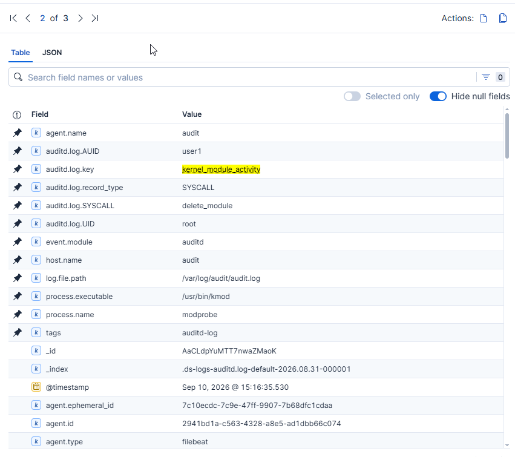

```
{
  "auditd": {
    "log": {
      "record_type": "SYSCALL",
      "key": "kernel_module_activity",
      "SYSCALL": "delete_module",
      "success": true,
      "AUID": "user1",
      "tty": "pts0"
    }
  }
}
```

### Detection Analysis

|Observation|Value|
|---|---|
|Operation|Kernel module unloaded|
|Syscall|`delete_module`|
|Process|`modprobe`|
|Executable|`/usr/bin/kmod`|
|Initiating User|`user1` (AUID)|
|Effective User|`root`|
|Privilege Level|Ring 0|
|Result|Success|

---

## Why does the event show `syscall=176`?

Removing a loaded kernel module invokes the Linux `delete_module()` syscall.

On x86_64 systems this syscall corresponds to numeric identifier **176**, which Auditd records before Elastic converts it into the readable syscall name.

```
176 → delete_module
```


# Notes and Limitations

During testing, Elastic successfully parsed the `SYSCALL` audit records, exposing fields such as the syscall name, executable, initiating user, and execution result.

However, the accompanying `KERN_MODULE` record—which contains the loaded module name (for example `dummy`)—was not parsed into a dedicated field by the Auditbeat/Filebeat pipeline.

As a result, the module name remains visible in the raw `ausearch` output but is not directly searchable in the default Elastic document. Correlating both records still provides complete visibility into kernel module activity.

---

## Conclusion

Part 2 focused on building practical Linux detection content around activities that commonly appear during post-exploitation, persistence, and privilege abuse.

The implemented rules cover account management, cron persistence, systemd service modifications, mount operations, and kernel module activity. 
Each detection was validated end-to-end—from Auditd event generation to Elastic ingestion and event analysis—while documenting both successful detections and implementation limitations encountered during testing.

Together, Parts 1 and 2 establish a reusable Linux Auditd monitoring baseline that can be further expanded with Sigma rules, Elastic detection rules, MITRE ATT&CK mapping, and automated alerting workflows.
