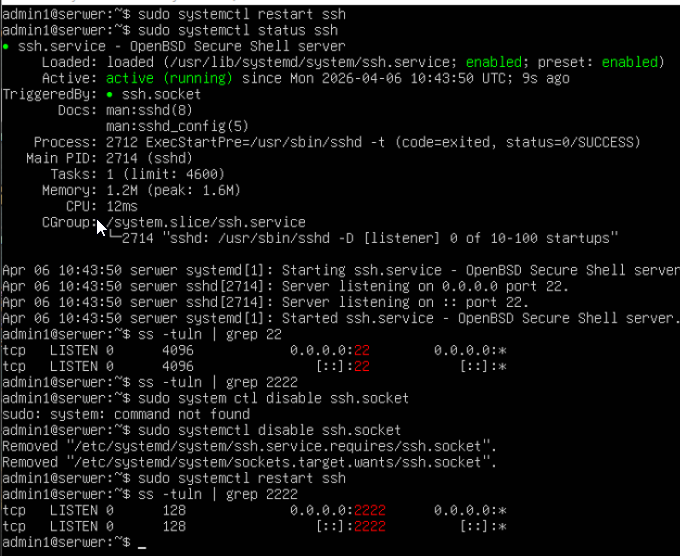
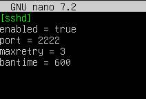
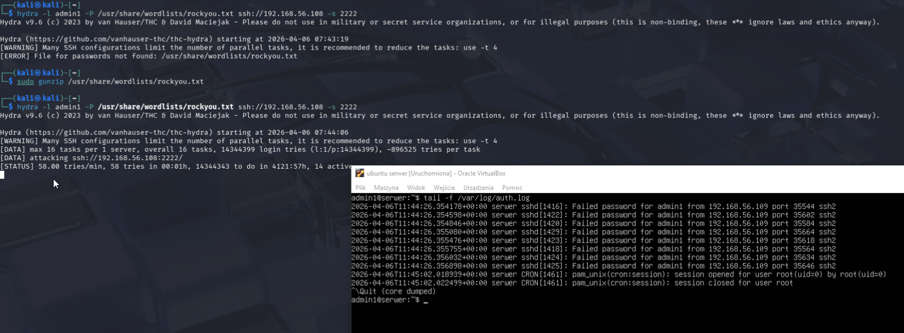
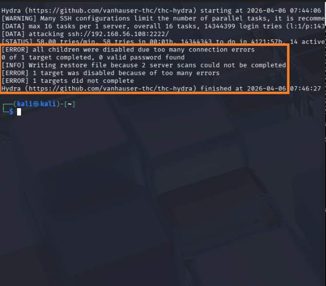
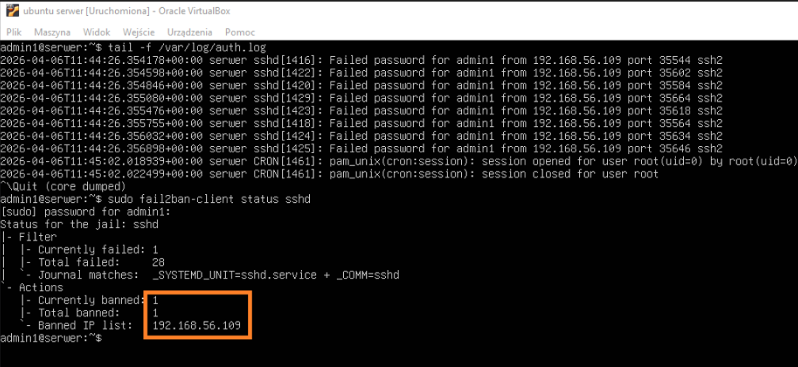
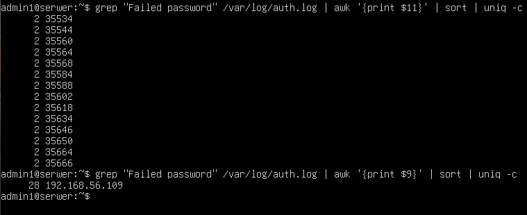

# Linux Server Hardening & SSH Brute Force Simulation


I used ubuntu server on Virtualbox as a target, and Kali linux also on Virtualbox as attacker.


After basic installation of both machines I configured ssh service and changed default port to `2222`


rule with port didn't apply as `ssh.socket` was running and ignoring my  `sshd_config` change so it had to be turned off



Then, it was time for firewall installation:
```Bash
sudo apt install ufw -y
sudo ufw default deny incoming
sudo ufw default allow outgoing
sudo ufw allow 2222/tcp
sudo ufw enable
```
blocking all incoming traffic and allowing ssh on custonm port

next, installation `fail2ban` on a server and its basic configutation


`fail2ban`  is a security tool that monitors system logs for suspicious activity, such as repeated failed login attempts. When it detects such behavior, it automatically blocks the offending IP address using firewall rules for a specified period



`maxretry` - allowed password attempts

`bantime` - ban duration in seconds

Then I had to configure network on both machines -  **Host-only** on both so they comunicate only between each other


After succesful ping between devices I sent an attack from Kali
```Bash
hydra -l admin1 -P /usr/share/wordlists/rockyou.txt ssh://192.168.56.108 -s 2222
```
As `fail2ban` was active I could display failed login attempts real time from logs
```Bash
tail -f /var/log/auth.log
```



Failed Hydra attack:




Kali ip was added to banned ip list in fail2ban status:




In the end I used `grep` to get clear display of attempts from logs
```Bash
grep "Failed password" /var/log/auth.log | awk '{print $11}' | sort | uniq -c

```
this variation shows number of attempted logins and its ports (in this case we had 2 attemps on every shown port)

```Bash
grep "Failed password" /var/log/auth.log | awk '{print $9}' | sort | uniq -c
```
this on the other hand shows number of attempts from a specific IP 




As it is my first ever experience with publishing my lab practices its a bit clunky, and basic - later on it will develop better fluency and "flow", gained from experience
